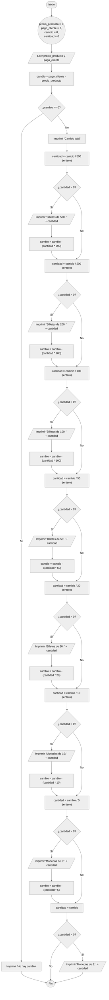

```mermaid
%%{init: {'theme': 'neutral'}}%%
flowchart TD
    Start([Inicio]) --> Init((precio_producto = 0,<br/>pago_cliente = 0,<br/>cambio = 0,<br/>cantidad = 0))
    Init --> ReadData[/Leer precio_producto y pago_cliente/]
    ReadData --> CalcChange[cambio = pago_cliente - precio_producto]
    CalcChange --> IsZero{¿cambio == 0?}

    IsZero -- Sí --> PrintNoChange[Imprimir 'No hay cambio']
    PrintNoChange --> End([Fin])

    IsZero -- No --> PrintTotal[Imprimir 'Cambio total']
    
    %% Billetes de 500
    PrintTotal --> C500["cantidad = cambio / 500 (entero)"]
    C500 --> Q500{¿cantidad > 0?}
    Q500 -- Sí --> P500[/Imprimir 'Billetes de 500: ' + cantidad/]
    P500 --> R500["cambio = cambio - (cantidad * 500)"]
    R500 --> C200
    Q500 -- No --> C200

    %% Billetes de 200
    C200["cantidad = cambio / 200 (entero)"]
    C200 --> Q200{¿cantidad > 0?}
    Q200 -- Sí --> P200[/Imprimir 'Billetes de 200: ' + cantidad/]
    P200 --> R200["cambio = cambio - (cantidad * 200)"]
    R200 --> C100
    Q200 -- No --> C100

    %% Billetes de 100
    C100["cantidad = cambio / 100 (entero)"]
    C100 --> Q100{¿cantidad > 0?}
    Q100 -- Sí --> P100[/Imprimir 'Billetes de 100: ' + cantidad/]
    P100 --> R100["cambio = cambio - (cantidad * 100)"]
    R100 --> C50
    Q100 -- No --> C50

    %% Billetes de 50
    C50["cantidad = cambio / 50 (entero)"]
    C50 --> Q50{¿cantidad > 0?}
    Q50 -- Sí --> P50[/Imprimir 'Billetes de 50: ' + cantidad/]
    P50 --> R50["cambio = cambio - (cantidad * 50)"]
    R50 --> C20
    Q50 -- No --> C20

    %% Billetes de 20
    C20["cantidad = cambio / 20 (entero)"]
    C20 --> Q20{¿cantidad > 0?}
    Q20 -- Sí --> P20[/Imprimir 'Billetes de 20: ' + cantidad/]
    P20 --> R20["cambio = cambio - (cantidad * 20)"]
    R20 --> C10
    Q20 -- No --> C10

    %% Monedas de 10
    C10["cantidad = cambio / 10 (entero)"]
    C10 --> Q10{¿cantidad > 0?}
    Q10 -- Sí --> P10[/Imprimir 'Monedas de 10: ' + cantidad/]
    P10 --> R10["cambio = cambio - (cantidad * 10)"]
    R10 --> C5
    Q10 -- No --> C5

    %% Monedas de 5
    C5["cantidad = cambio / 5 (entero)"]
    C5 --> Q5{¿cantidad > 0?}
    Q5 -- Sí --> P5[/Imprimir 'Monedas de 5: ' + cantidad/]
    P5 --> R5["cambio = cambio - (cantidad * 5)"]
    R5 --> C1
    Q5 -- No --> C1

    %% Monedas de 1
    C1["cantidad = cambio"]
    C1 --> Q1{¿cantidad > 0?}
    Q1 -- Sí --> P1[/Imprimir 'Monedas de 1: ' + cantidad/]
    Q1 -- No --> End
    P1 --> End
```
