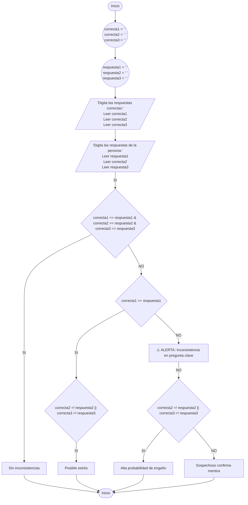

```mermaid
flowchart TB
A(["Inicio"]) --> B(("correcta1 = ' ' <br> correcta2 = ' ' <br> correcta3 = ' '"))
B --> C(("respuesta1 = ' ' <br> respuesta2 = ' ' <br> respuesta3 = ' '"))

C --> D[/"'Digita las respuestas correctas:'<br>Leer correcta1<br>Leer correcta2<br>Leer correcta3"/]
D --> E[/"'Digita las respuestas de la persona:'<br>Leer respuesta1<br>Leer correcta2<br>Leer respuesta3"/]

E --SI--> H{"correcta1 == respuesta1 & correcta2 == respuesta2 & correcta3 == respuesta3"}
H --SI--> I["Sin inconsistencias"]

H --NO--> F{"correcta1 == respuesta1"}
F --NO--> G["⚠️ ALERTA: Inconsistencia en pregunta clave"]

F --SI--> J{"correcta2 =! respuesta2 || correcta3 =! respuesta3"}
J --SI--> K["Posible estrés"]

G--NO--> L{"correcta2 =! respuesta2 || correcta3 =! respuesta3"}
L --SI--> M["Alta probabilidad de engaño"]

L --NO--> N["Sospechoso confirma mentira"]

I --> O(["Inicio"])
K --> O
M --> O
N --> O
```