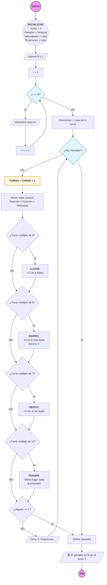

```mermaid
graph TD
    %% Inicio del proceso
    Inicio((<b>INICIO</b>)) --> Inicializar((<b>INICIALIZAR:</b><br/>Turno = 0<br/>Ganador = Ninguno<br/>Velocidades = Lista<br/>Posiciones = Lista))
    Inicializar --> LeerNL[/ "Ingrese N y L" /]

    %% Ciclo para leer velocidades
    LeerNL --> InitI[i = 1]
    InitI --> LoopV{¿i <= N?}
    LoopV -- SI --> LeerV[/ "Velocidad caracol i" /]
    LeerV --> IncI[i = i + 1]
    IncI --> LoopV

    LoopV -- NO --> InitPos[Posiciones = Lista de N ceros]

    %% Ciclo Principal
    InitPos --> Loop{¿Hay Ganador?}

    Loop -- NO --> IncTurno[<b>TURNO = TURNO + 1</b>]

    %% Movimiento Base
    IncTurno --> MoverBase[Mover cada caracol:<br/>Posición = Posición + Velocidad]

    %% Sección de Eventos
    MoverBase --> Evento3{¿Turno múltiplo de 3?}
    Evento3 -- SI --> Lluvia[<b>LLUVIA:</b><br/>+1 cm a todos]
    Evento3 -- NO --> Evento5{¿Turno múltiplo de 5?}

    Lluvia --> Evento5

    Evento5 -- SI --> Barro[<b>BARRO:</b><br/>-2 cm al más lento<br/>Mínimo 0]
    Evento5 -- NO --> Evento7{¿Turno múltiplo de 7?}

    Barro --> Evento7

    Evento7 -- SI --> Viento[<b>VIENTO:</b><br/>+3 cm al 1er lugar]
    Evento7 -- NO --> Evento11{¿Turno múltiplo de 11?}

    Viento --> Evento11

    Evento11 -- SI --> Trampa[<b>TRAMPA:</b><br/>Último lugar salta<br/>al promedio]
    Evento11 -- NO --> VerifMeta

    Trampa --> VerifMeta

    %% Verificación de Meta
    VerifMeta{¿Alguien >= L?}
    VerifMeta -- NO --> MostrarEstado[/ "Turno X: Posiciones..." /]
    MostrarEstado --> Loop

    VerifMeta -- SI --> SetGanador[Definir Ganador]

    %% Finalización
    SetGanador --> FinCarrera[/ "🏆 El ganador es G en el turno T" /]
    Loop -- SI --> SetGanador
    FinCarrera --> Fin((<b>FIN</b>))

    %% Estilos
    style Inicio fill:#f9f,stroke:#333,stroke-width:2px
    style Fin fill:#f9f,stroke:#333,stroke-width:2px
    style IncTurno fill:#fff4dd,stroke:#d4a017,stroke-width:2px
    style Loop fill:#e1f5fe,stroke:#01579b
    style LoopV fill:#e1f5fe,stroke:#01579b
```
